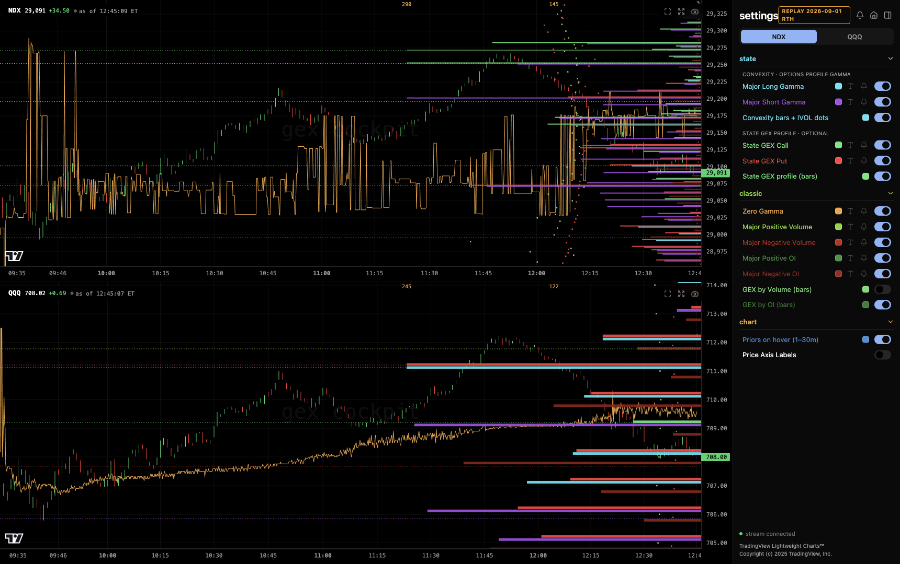
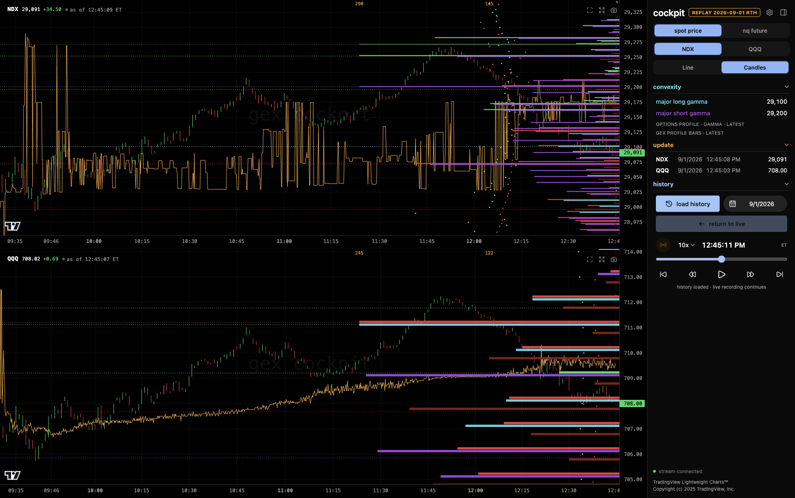

# GEX Cockpit

**[Español](README.es.md) · English**

A local dashboard for viewing **State and Classic from [GexBot](https://www.gexbot.com) together** on the same NDX and QQQ charts. Compare gamma-exposure profiles and key levels, replay your recorded sessions, and receive desktop level alerts on macOS. It does not connect to a broker or place orders.

The app runs on your computer. Your API key, settings and recorded history stay there. It contacts GexBot for market data; open-source code does not include a data subscription or permission to redistribute provider data. This is an independent project, not an official GexBot or TradingView product.

## See it in action

**State + Classic in one view**, with separate controls for each layer.



<details>
<summary>See the session replay controls</summary>

Revisit a recorded session, move through its timeline, and control playback speed.



</details>

Both screenshots show a recorded session from September 1, 2026.

## Let your AI agent install it

Open this repository folder in an agent that can work on your computer and paste:

> Help me install GEX Cockpit. Before doing anything, ask whether I prefer English or Spanish and wait for my answer. Follow AGENTS.md. Explain each step and every main app control in simple terms. Help me choose an installation with optional updates or a ZIP copy without Git. Never update automatically. Keep my API key private and verify the app actually receives data before saying setup is complete.

No coding knowledge is needed. The agent should do the technical work and leave you simple start/stop instructions. The setup conversation can be Spanish; **the app interface currently uses English labels**.

## What you need

- A computer with [Bun](https://bun.com/docs/installation), the program that runs the app. This checkout is tested with Bun **1.3.12**; use that version for reproducibility.
- Your own GexBot API key with access to the required feeds. Confirm access and any price with GexBot before purchasing.
- Internet access for live data and dependency installation.
- macOS for native desktop alerts. Windows/Linux chart setup is not yet verified end to end; native alerts will not work there. Leave Level Alerts off on those systems.

## Install manually

Choose **one** way to get the source:

| Choice | What it means |
| --- | --- |
| Agent-managed Git copy | Recommended for easy future updates. Your agent can get changes when you ask. You do not need to learn Git, fork the project, or create a GitHub account to clone a public repo. |
| ZIP download | No Git required. Use a published release's source ZIP, or GitHub's **Code → Download ZIP**, and extract it to a permanent folder. You can keep it unchanged. |

For the Git option:

```sh
git clone https://github.com/nicolasgomeztoua/gex-cockpit.git
cd gex-cockpit
```

For ZIP, open a terminal in the extracted folder containing `package.json`. For either option:

1. Install Bun using its [official instructions](https://bun.com/docs/installation), then check `bun --version`.
2. Copy `.env.example` to `.env.local` in this folder. Replace the empty `GEXBOT_API_KEY=` value with your key using a local text editor. Do not paste your key into agent chat, screenshots, issues, or terminal commands. Keep this file private.
3. Run these commands, one at a time:

```sh
bun install --frozen-lockfile
bun run build
bun start
```

`install` downloads the exact dependencies in `bun.lock`. `build` prepares the browser interface. `start` runs the local server and begins collecting data. The database is created automatically; you do not need to install a database server or run migrations manually.

Open **http://127.0.0.1:4321** in your browser. Keep the terminal open and computer awake. Check both charts have provider data; “stream connected” only confirms a connection to the local app, not fresh market data. A new installation has no previously recorded sessions. Outside market hours, history may be empty.

## Daily use

From the same app folder, run `bun start` and open the address above. Stop with **Ctrl+C** in that terminal. Closing the browser does not stop the backend. A computer shutdown or sleep stops live monitoring; startup is not automatic.

Read the [plain-language app guide](docs/trader-guide.md) for chart layers, futures conversion, replay, settings and alerts. On Mac, use **Test desktop alert** and verify you see/hear it. Polls normally arrive every 10 seconds; a brief touch between samples can be missed. Treat the app as market context, not an execution feed or trading recommendation.

## Updates are your choice

There is no automatic updater. If you like your version, keep using it: no pull, commit, push, or regular Git maintenance is required. Future provider/API or operating-system changes may eventually require an update.

When you want changes, ask your agent to follow [updates and backups](docs/updates.md). It should explain the changes first, preserve your key/settings/history, and keep a rollback copy. ZIP users can also update later by downloading into a new folder.

## Help and development

- [Setup, troubleshooting and agent verification](AGENTS.md)
- [What every main control does / Guía de uso](docs/trader-guide.md)
- [Configuration and developer commands](docs/configuration.md)
- [Contributing](CONTRIBUTING.md) · [Security](SECURITY.md)

MIT licensed; see [LICENSE](LICENSE). Third-party libraries retain their own licenses; see [THIRD_PARTY_NOTICES.md](THIRD_PARTY_NOTICES.md). `private: true` in package.json prevents accidental npm publication; it does not restrict the source license.
